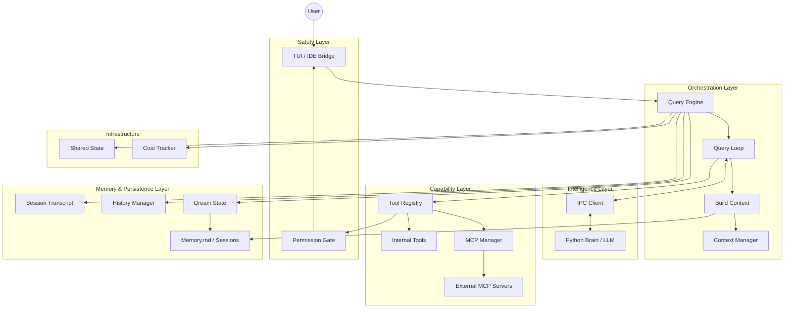
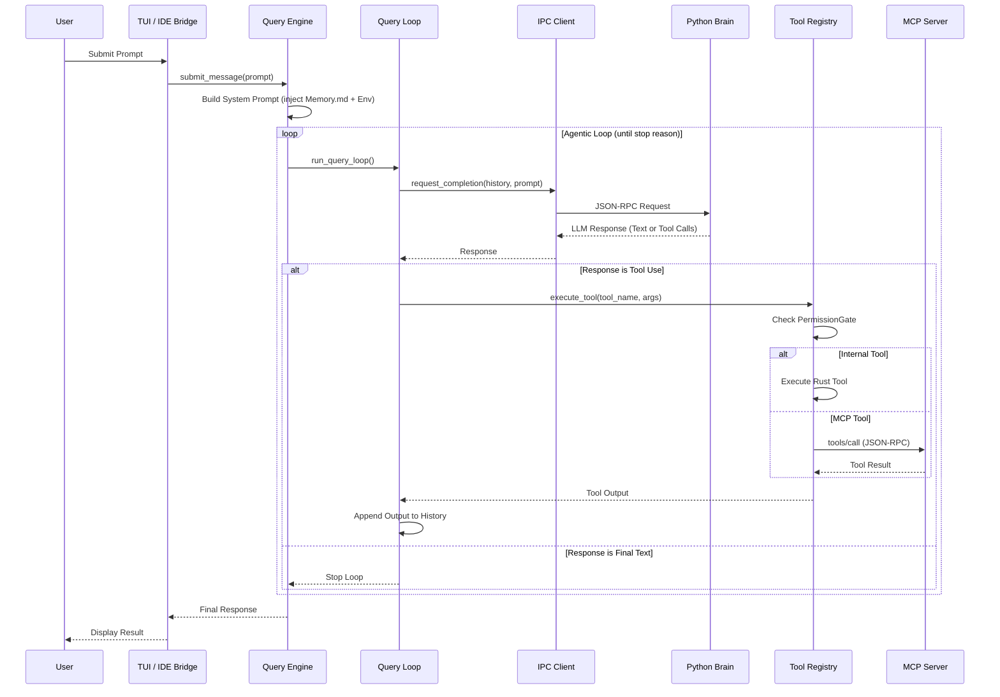

# AI Agent Structure Diagram - Centaur Psicode

This document describes the architectural structure of the Centaur Psicode AI Agent.

## High-Level Architecture

The agent is implemented as a Rust core that manages the agentic loop, tool execution, and user interface, while delegating the core LLM interaction to a "Python Brain" via Inter-Process Communication (IPC).

### Component Diagram (Mermaid)

## Interaction Sequence (Single Turn)

The following sequence diagram details the flow of a single agentic iteration.

## Detailed Component Descriptions

### 1. Orchestration Layer
- **Query Engine (`QueryEngine`, `src/query_engine.rs`)**: Manages the lifetime of a conversational session. It handles the high-level prompt submission, session initialization, and coordinates between the UI and the query loop.
- **Query Loop (`query_loop`, `src/query/query_loop.rs`)**: The core "Think-Act-Observe" loop.
    - **Think**: Requests a completion from the LLM via IPC.
    - **Act**: If the LLM requests tool use, the loop identifies the tools and triggers their execution.
    - **Observe**: Collects tool outputs and feeds them back into the conversation history.

### 2. Intelligence Layer
- **IPC Client (`IpcClient`, `src/ipc/`)**: A communication bridge that allows the Rust core to interact with a separate Python process.
- **Python Brain**: The component responsible for interfacing with the LLM (e.g., Claude), managing prompt templates, and returning structured tool calls or text.

### 3. Capability Layer
- **Tool Registry (`ToolRegistry`, `src/tools/`)**: Maintains a list of all tools available to the agent.
- **MCP Manager (`McpManager`, `src/mcp_client.rs`)**: Implements the Model Context Protocol. It spawns external server processes via stdio, discovers their tools, and wraps them as `LiveMcpTool` for the `ToolRegistry`.
- **Internal Tools**: A set of built-in tools for file manipulation, shell execution, and codebase analysis.

### 4. Safety Layer
- **Permission Gate (`PermissionGate`, `src/permissions/`)**: A guardrail that intercepts tool calls. Based on the configuration (e.g., `Bypass` vs `Default`), it can either allow the tool, block it, or send a request to the TUI to ask the user for explicit permission.

### 5. Memory & Persistence Layer
- **Context Manager (`context.rs`, `src/context/`)**: Dynamically gathers system context (OS, shell, date, git info) and user context (`CLAUDE.md`) to build the system prompt.
- **Dream State (`DreamState`, `src/dream/`)**: A background process for **Automatic Memory Consolidation**. It uses a set of "gates" (Time, Session Count, Lock) to determine when to run. When triggered, it sends a `MemoryRequest` to the Python Brain to scan recent sessions and synthesize knowledge into `MEMORY.md`.
- **Session Transcript**: Records every turn of a conversation for later review and memory processing.
- **Memory Integration**: Injects contents of the `MEMORY.md` file into the system prompt to provide the agent with long-term persistent knowledge.

### 6. Infrastructure
- **Shared State**: A thread-safe container for global settings, such as the current working directory and the `plan_mode` flag.
- **Cost Tracker**: Monitors the token usage and financial cost of the current session in real-time.
- **TUI / IDE Bridge**: Provides the user interface. The IDE bridge allows the agent to be controlled directly from VS Code or other editors.

## Advanced Features

### Plan Mode
When `plan_mode` is enabled in the shared state, the `QueryEngine` injects a directive into the system prompt instructing the agent to describe its intentions without executing tools that modify the filesystem or run commands.

### MCP Integration Detail
The `McpManager` implements a full JSON-RPC 2.0 pipeline over stdio:
1. **Discovery**: Reads `.claude/settings.json` to find server commands.
2. **Handshake**: Performs the mandatory MCP `initialize` handshake.
3. **Registration**: Maps remote MCP tools to local `LiveMcpTool` instances, allowing the LLM to call external tools as if they were internal.

## Data Flow Summary

1. **Context Assembly**: `QueryEngine` builds a prompt $\rightarrow$ Env + `CLAUDE.md` + `MEMORY.md`.
2. **Intelligence Loop**: `QueryLoop` $\leftrightarrow$ `IpcClient` $\leftrightarrow$ `Python Brain`.
3. **Action Execution**: `ToolRegistry` $\rightarrow$ `PermissionGate` $\rightarrow$ (Internal Tool / MCP Server).
4. **Memory Consolidation**: `DreamState` $\rightarrow$ `MemoryRequest` $\rightarrow$ `Python Brain` $\rightarrow$ `MEMORY.md`.
